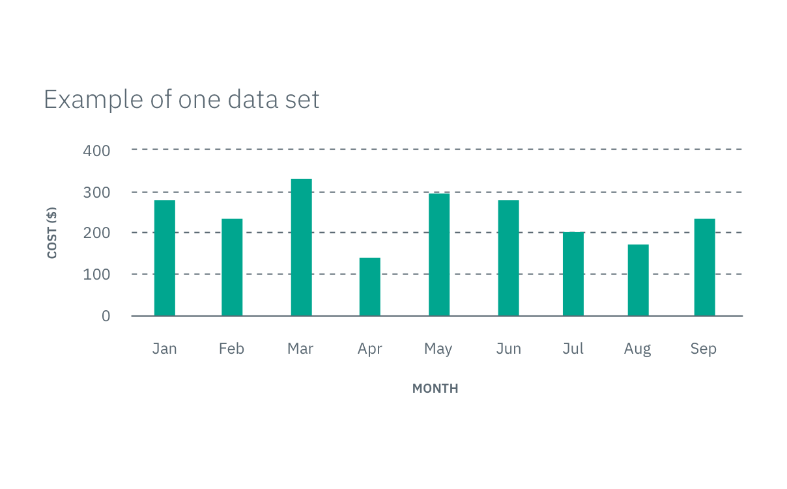
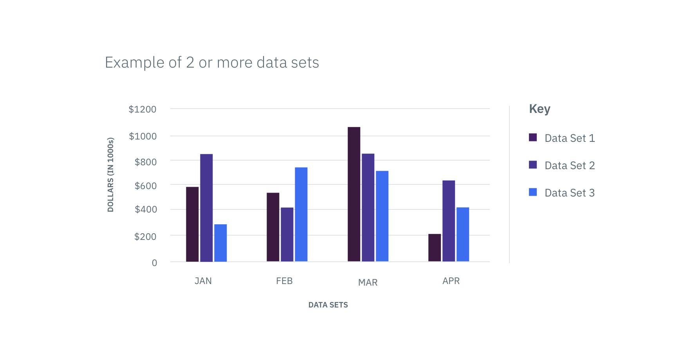
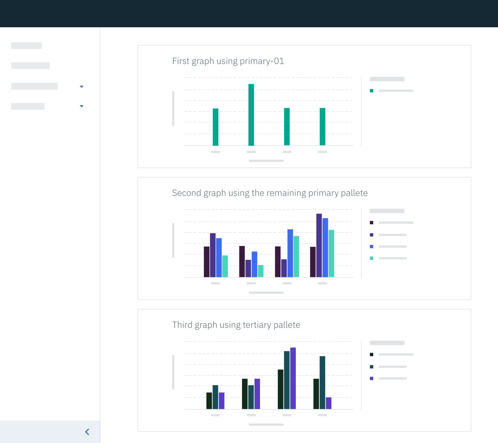

## General guidelines

There are three theme palettes for data visualizations: primary, secondary, and tertiary. Each palette has been carefully chosen to meet contrast standards for color blindness, with a majority of the colors meeting the Web Content Accessibility Guidelines (WCAG) color contrast requirements of 3.5:1. Data visualizations should always be shown on a white (#fff) background.

_Disclaimer: Please note that the first four colors in the palette themes meet the [WCAG 2.1](https://www.w3.org/TR/WCAG21/#sotd) guidelines for accessibility. The last color of each palette does not. This was an intentional decision made in order meet the contrast requirements for color blindness._

<!-- The hover-able palettes go here and are split into the following three sections -->

##### Primary theme
primary-01  #3B1A40
primary-02  #473793
primary-03  #3C6DF0
primary-04  #00A68F
primary-05  #48D4BB

##### Secondary theme
secondary-01  #112C1B
secondary-02  #164D56
secondary-03  #5A3EC8
secondary-04  #9B82F3
secondary-05  #EFCEF3

##### Tertiary theme
tertiary-01  #252E6A
tertiary-02  #602797
tertiary-03  #9320A2
tertiary-04  #009BEF
tertiary-05  #F7AAC3

## Color usage best practices

Apply the primary data vis color `primary-04` when using only one data set. If you are comparing multiple sets of data, start by using colors in the primary theme so that each data set is assigned its own color. The primary theme is always used for the first data visualization on any given page. If there is more than one data visualization on a page, the secondary and/or tertiary themes may be used.

If you have multiple graphs on a page where your first graph is only using the primary data vis color (primary-04) and your second graph requires multiple colors, use the remaining colors from the primary theme before using another palette.

For data visualizations with touching colors (no white space between blocks of color representing data), make sure to use the colors in the order they are shown from left to right (dark to light). For example, if you are comparing three sets of data, the colors `primary-01`, `primary-02`, and `primary-03` are used in that order, respectively.

| DATA SET/GRAPH           | THEME/COLOR     |
|--------------------------|-----------------|
| One data set             | primary-04      |
| Two+ data sets           | primary theme   |
| Two+ data visualizations | primary theme, secondary theme, and/or tertiary theme |

### One data set

_Example of primary-04 applied to one data set_

### Two or more data sets

_Example of primary theme applied to two+ data sets_

### Two or more data visualizations on one page

_Example of two themes applied to two data visualizations_
