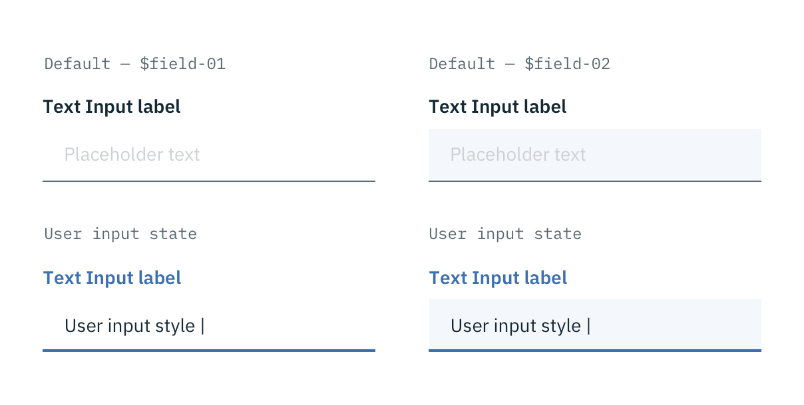
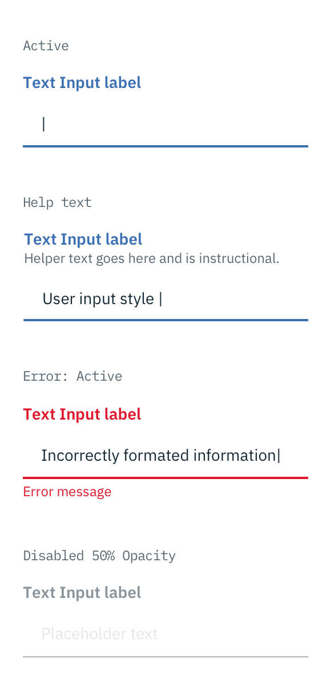

## Color

Text inputs come in two different colors. The default input color is `$field-01` and is used on `$ui-01` page backgrounds. The light version input color is `$field-02` and is used on `$ui-02` page backgrounds.

| Attribute             | SCSS          | HEX           |
|---------------------|---------------|---------------|
| Background: default | $field-01     | #f4f7fb |
| Background: light | $field-02     | #ffffff |
| Border bottom: enabled | $ui-05 | #5a6872 |
| Border bottom: focused | $brand-01 | #3d70b2 |
| Border bottom: error | $support-01 | #e0182d |
| Label: enabled | $text-01      | #152935       |
| Label: focused| $brand-01 | #3d70b2 |
| Label: error | $support-01 | #e0182d |
| Text: user input  | $text-01      | #152935       |
| Text: placeholder | $text-03      | #cdd1d4       |
| Text: help | $text-02 | #5a6872 |
| Text: error message   | $support-01        | #e0182d   |

---
***
> 

_Examples of default and user-input states for Text Input_

## Typography

Text Input labels and placeholder text should be set in sentence case, with only the first word in a phrase and any proper nouns capitalized. Text Input labels should be three words or less.

| Property | Font-size (px/rem)     | Font-weight  | Type style |
|----------|-----------------|--------------|---|
| Label    | 14 / 0.875 | Semi-Bold / 600   | Zeta |
| Text: input     | 14 / 0.875 | Normal / 400 |- |
| Text: help      | 12 / 0.75  | Normal / 400 |- |
| Text: error message | 12 / 0.75 | Normal / 400 | - |

## Structure

| Property                    | px | rem   |
|-----------------------------|----|-------|
| Height                      | 40 | 2.5   |
| Spacing: Label & select box | 8  | 0.5   |
| Spacing: Label & hint text  | 2  | 0.125 |
| Internal spacing            | 16 | 1     |
| Groupings: vertical         | 32 | 2     |
| Groupings: horizontal       | 16 | 1     |
| Border bottom: enabled      | 1 | 0.0625rem |
| Border bottom: focused      | 2 | 0.125 |

_Structure and spacing measurements for Text Input | px / rem_

### States

**Active:** Placeholder text should remain when the user clicks into the text input and gets a cursor. Once the user starts typing the hint text is replaced with the user input text.

**Help text:** Help text appears below the label when the text input is active. Help text remains visible while the input is focused and disappears after focus away.

**Error:** Error messages appear below the input field and are always present while invalid.

**Disabled:** Disabled state has a `.not-allowed` cursor hover and appears at 50% opacity.

---
***
> 

_Examples of active, help, error and disabled Text Input states_
