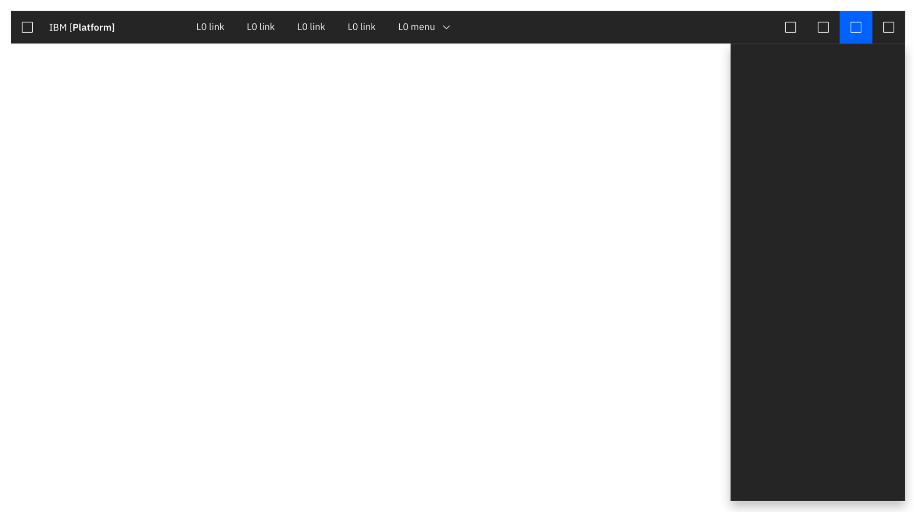
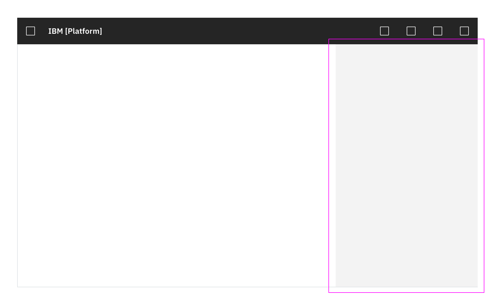
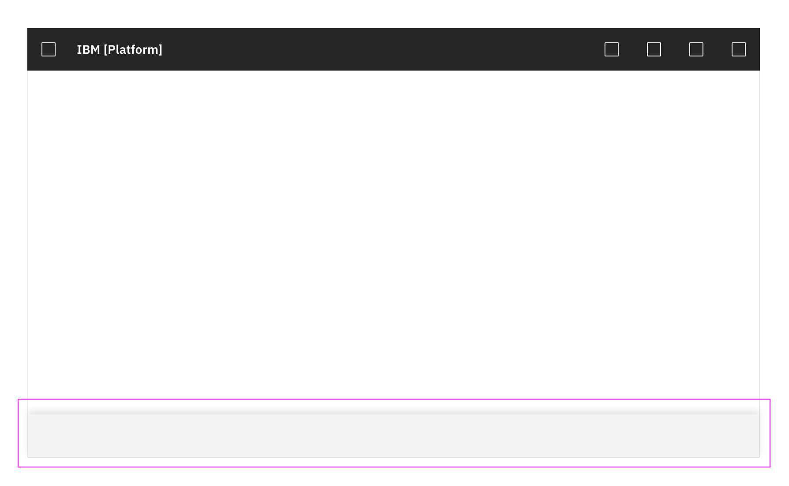
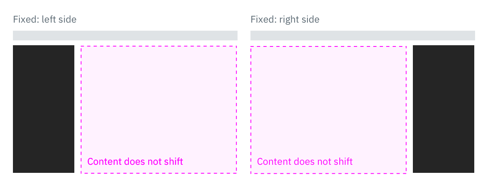

# UI Shell
The UI Shell is the top level in a product's UI. The Shell consists of the primary **header** and **footer**, as well as **header panels** that are used for navigation and global UI services.

## UI Shell "Zones"
The shell is divided into 3 distinct "zones" which establish purpose and level of control.

The **Global** zone holds the IBM global platform switcher, which allows the user to quickly navigate between different IBM platforms. This zone cannot be altered by the platform or product owner.

The **Platform** zone contains platform-level elements, which could include functions like search, docs, support, profile, and notifications. Platform owners can also choose to include custom top-nav text links in this zone. <mark>*CJC NOTE: should we clarify the difference between text links and right-side icon usage here?*</mark> 

The **Local** zone is controlled at the product level. It contains the product-level side nav as well as the main content area.  

## UI Shell Components
### Primary Header
The Header spans the full width of the viewport and is the topmost element in the UI. Header elements do not change from page to page. The header contains:

1. Platform icon or L1 menu icon <mark>CJC: What are the guidelines for deciding which of these to use?</mark>
* Platform name
* Up to 5 optional horizontal nav links and/or menus <mark>What are the guidelines for menus in this case? Expand on hover? Expand on click?</mark>
* L0 icons

### Header Panels
These are vertical panels that are anchored in the Header and invoked by controls on the right side of the Header. Header Panels have a consistent width, span the full height of the viewport and are flush to the right edge of the viewport. Only one Header Panel can be open at a time. The Profile and Notifications panels are examples of this element. Header Panels are always treated as "floating" panels.

### Side-Nav Panels
These panels contain product-level navigation and can be either fixed-width or flexible.

### On-Page Panels
These panels are at the same elevation as the primary content zone of the page, and can be either dismissable or fully fixed. 

### Footer
Product footers are persistent and attached to the bottom of the browser window. A footer should be reserved for actions or information that is pertinent to the users current workflow. Footers should have clear means of dismissal. <mark>This is an unusual way to treat a footer, especially with it being dismissable... Is this really how we want to define them? -CJC</mark> <mark>Which "zone" does the footer belong to? - CJC</mark> 

## Side Navigation

### L1 Navigation Menu 

<mark> I am confused by this component and how it relates to the L2 Side-nav. - CJC </mark>
The primary level on navigation for a platform outside of the header is contained within the L1 Navigation Menu. Items in the L1 Navigation Menu are persistent and do not change as the context of the platform. The L1 Navigation Menu can be accessed at any time by clicking on the hamburger menu icon in the far left of the header. It has a floating panel style and when open overlays content on the page.

### L2 Side-nav
The Side-nav contains secondary level navigation and fits below the header. It can be either fixed-width or flexible with only one level of nested items allowed. Both L2 links and L2 Category lists can be used in the Side-nav and may be mixed together.

#### Side-nav Items
- **L2 Link:** Links to different pages   
- **L2 Category:** A Category must contain at least two L2 links. Categories can be either collapsible or fixed. The label of a Category is never a link.
- **L1 Title Bar** (optional): contains the local section name. <mark>What is a local section name? - CJC</mark> It should link to the product's landing page or main console. This element can also include an optional selector element, to enable context-switching. <mark>This needs some more explanation - CJC</mark>

#### Flexible Side-nav
The Flexible Side-nav has both an expanded and collapsed state. The expanded state contains both icons and corresponding L2 text, while the collapsed state shows only the icon. The side-nav is expanded or collapsed by clicking on the chevron icon at the bottom of the panel. <mark>Isn't this supposed to expand on hover? -CJC</mark>  

In a Flexible Side-nav, each L2 link and L2 category list has its own corresponding icon. Side-nav icons are stacked equidistant from each other <mark>How far apart? - CJC</mark> in the collapsed state, and when expanded are aligned with their corresponding L2 labels. 

#### Fixed Side-nav
A fixed Side-nav contains only L2 Links and L2 Category lists, no icons, and cannot be collapsed. 

## Panel Styles
All vertical panels expand to fill the full height of the browser window.
### Flexible Panel
The Flexible Panel style allows for both a collapsed state and an expanded state. The expanded state of a Flexible Panel is a fixed width and cannot be adjusted by the user. By default, the collapsed Flexible Panel will expand when the user hovers over any portion of panel. The user can lock this panel into the expanded or collapsed state by clicking on the chevron control at the bottom of the panel. Flexible side nav panels should default to the expanded state on first use.

### Fixed Panel
Fixed panels maintain a static width and come in two sizes: default (256 px) and small (208 px). 

<mark> Make animated </mark>

### Floating Panel
This panel style is at a higher elevation than the primary content area and includes a drop shadow. Floating panels conceal any UI elements below them and must be dismissable by the user. Floating panels are always fixed-width. <mark> I don't understand why we would ever advocate for using this approach for side navigation - CJC </mark>

<mark> Not wild about the word "overlaid." It often connotes transparency. Suggest changing to "covered" or "hidden"

## UI Shell Theming
The UI Shell will be themeable and can be either light or dark. *More information how to apply a shell theme coming soon.* 

<mark># Clay Questions
-What are the recommended uses for on-page panels?
-Is there a specific width for floating panels?
</mark>
  

  <!--The left side navigation component can be fixed or flexible-width. It allows for two levels of nesting.

#### L1 title bar (optional)

The L1 element contains the name of the product. It should link to the product's landing page or main console. This element can also include an optional selector element, to enable context-switching.
 
#### L2 nav items

L2 nav items can be either a Category or a Link. When clicked, L2 Categories reveal or hide a group of L3 Links. L2 Category items cannot contain links.

#### L3 Links
A Category must contain at least 3 L3 Links.

<mark>Side nav with L1, L2, L3 annotations. 

-->