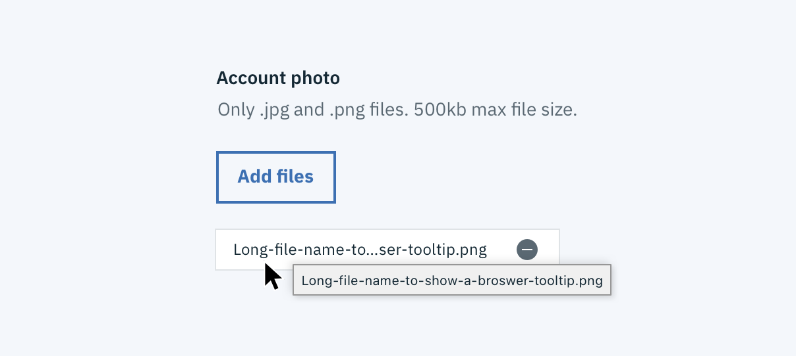

## Cursors

Cursors are used to indicate to the user the action they can take. Below is a chart of common cursors that are built into the Carbon components. Hover over a row to see each particular cursor in action.

| Cursor property  | Example | Usage |
|------------------|---------|-------|
| `default`        | | The cursor a system automatically defaults to. Can be white or black depending on the operating system. |
| `not-allowed`    |  | Used to indicate that an item is disabled and no action can be taken on the component.|
| `pointer`        |  | Used to indicate a link or clickable object. |
| `text`           |  | Used to indicate that a user can type into a designated area, or that the text can be highlighted. |


For a more comprehensive list of cursors checkout [mozilla](https://developer.mozilla.org/en-US/docs/Web/CSS/cursor).

### Browser Tooltip

A browser tooltip is a 'tooltip' generated by the browser that appears on extended hover. The tooltip is styled differently depending on the browser, however its content remains consistent across the board. A browser tooltip can be added to an html element by adding the `title` attribute and filling it with content. For example:

```sh

```


Browser tooltips are great for accessibility as they add an extra layer of clarity and specification. An example of a browser tooltip is when a text string has front-end or middle truncation. The user hovers over the truncated text and a browser tooltip appears with the entire sting of non-truncated text. 


