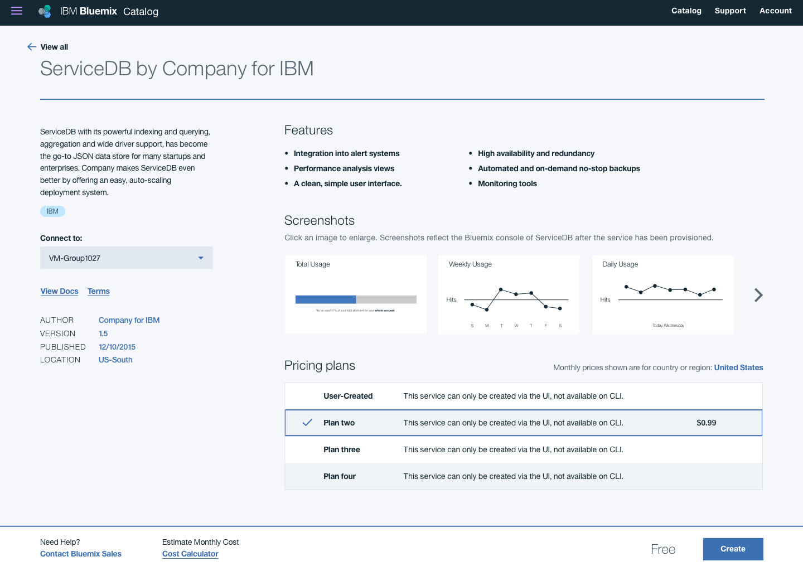
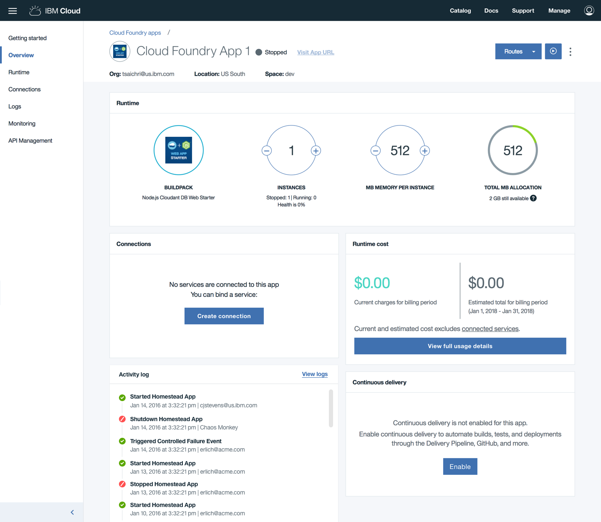

## Introduction

The IBM Cloud platform is a collection of behaviors and capabilities that are tied together through the IBM Cloud console. Fully participatory services share capabilities and tooling to ensure a professional, performant, consistent, and cohesive platform experience.

This document will guide you through the design and implementation of your service as part of the IBM Cloud Platform. It will provide instructions for specific aspects of the presentation layer, such as using Carbon and creating your service icons. Additionally, it will enumerate the requirements for Service Governance approvers and the process to get that approval. Following this guidance and execution steps will ensure the design portion of the approval process is straightforward.

Services must adopt these foundational capabilities to actively participate in the IBM Cloud platform:

* [RC (Resource Controller)](https://console.stage1.bluemix.net/docs/developing/resource-controller/overview.html#resource-controller): Manage the lifecycle of cloud resources using this next-generation provisioning layer.
* [Bluemix Console SDK](https://console.stage1.bluemix.net/docs/developing/console-sdk/index.html#getting-started): Learn how to develop your service as a microservice so that it will seamlessly integrate into the IBM Cloud platform.  
* [IAM (Identity and Access Management)](https://console.stage1.bluemix.net/docs/developing/Access-Management/index.html#iam_features): Securely authenticate users and control access to all cloud resources consistently. Learn how to onboard your service to IAM [here](https://console.stage1.bluemix.net/docs/developing/Access-Management/checklist_overview.html#getting-started-onboarding-overview).
* [BSS (Business Support Systems)](https://console.stage1.bluemix.net/docs/services/onboarding/new_service.html#onboarding-a-new-service-into-bluemix): Develop your pricing plan in RMC (Resource Management Console) by enabling [Metering](https://console.stage1.bluemix.net/docs/developing/metering/index.html#reporting_resource_usage) so IBM Cloud users are billed according to usage data.
* [GhoST (Global Search and Tagging System)](https://console.stage1.bluemix.net/docs/developing/GhoST/onboard.html#getting-started): Add resource types so they are visible in the IBM Cloud filesystem to better enable platform-wide search. Follow [these instructions](https://ibm.ent.box.com/s/qopacahpyg34z2urevv74mter742yfse) to onboard a new resource type. For more help, contact someone via Slack at [#global-search-tagging](https://ibm-cloudplatform.slack.com/messages/C11F8KA1Z/details/).
* [Global Catalog](https://console.stage1.bluemix.net/docs/developing/resource-catalog/index.html#global_catalog_overview): Record and manage your cloud offering across geographies.
* [Documentation](https://console.stage1.bluemix.net/docs/developing/writing/index.html#get-started): Compose content for each phase of your offering and continually update as your service pushes new changes.
* [Carbon Design System](http://design-system.stage1.mybluemix.net/): Use Carbon as a resource for [code](https://github.com/ibm/carbon-components), [visual](https://github.com/ibm/carbon-design-kit), and UX guidance when developing components and creating your service icon.

## Onboarding requirements

Onboard your service to IBM Cloud by fulfilling the following requirements. Design approval is required for each phase of the process including Experimental, Beta, GA, and post GA iterations.

### Enable NPS
* NPS (Net Promoter Score) is a management tool that measures customer relationships. To enable in-product NPS data collection for your service, follow [these instructions](https://pages.github.ibm.com/Bluemix/platform-analytics/data/nps/).

### Use Carbon
* Leverage the Carbon Design System for visual and user experience guidance. By utilizing the [Carbon Component Library](https://github.com/ibm/carbon-components), your development team can easily implement ready-made components to create comprehensive UI.
* If you are new to Carbon, get started as a [designer](http://carbondesignsystem.com/getting-started/designers) or [developer](http://carbondesignsystem.com/getting-started/developers), and check the [FAQ's](http://carbondesignsystem.com/getting-started/FAQ) to learn more.

### Confirm accessibility
Your service UI (e.g. Configuration, Dashboard) should follow [WCAG AA](https://www.w3.org/WAI/WCAG20/quickref/) gudielines. All Carbon components are designed to meet accessibility standards. However, if components are customized the designs must:

* Pass [color contrast ratios](https://www.w3.org/TR/UNDERSTANDING-WCAG20/visual-audio-contrast-contrast.html) and meet [color usage](http://carbondesignsystem.com/style/colors/usage) guidelines, which include type color combinations and [data visualization](http://carbondesignsystem.com/data-vis/overview/colors) best practices. If necessary, use a [color contrast checker](https://marijohannessen.github.io/color-contrast-checker/) to verify your design.
* Follow common [accessibility patterns](http://carbondesignsystem.com/guidelines/accessibility), such as keyboard tabbing, focus states, and nagivation order. 

### Service icon
Review the [service icon guidelines](#) for information on the design, production, approval, and submission of service icons.

### IBM Cloud UI
#### IBM Cloud Platform
Learn about the IBM Cloud Platform, including how the console works, plugin requirements for microservices, and more [here](https://console.stage1.bluemix.net/docs/developing/console-sdk/global-console.html#bluemix-global-console-overview). Every service should be navigable within the platform and does not launch out to a separate browser tab or window.

#### Service Configuration Page
A configuration page describes a service to potential customers. It may include but is not limited to the product description, images of the product, and the pricing table. Using Carbon components, create a configuration page that best characterizes your service.

#### Service Dashboard
Service Dashboards display information and details of an existing instance. Using Carbon components, create a dashboard that works for your service.

#### Common Header
IBM Cloud and its products share a global header with composable variations. See the [Add-ons](carbondesignsystem.com/add-ons/header/code) library to learn more about its behavior and consume the component.

## Resources
* [Developing in IBM Cloud](https://console.stage1.bluemix.net/docs/developing/index.html)
* [IBM Cloud Console SDK](https://console.stage1.bluemix.net/docs/developing/console-sdk/index.html#getting-started)
* [Service onboarding](https://console.stage1.bluemix.net/onboarding/login)
* [IBM Cloud onboarding FAQs](https://apps.na.collabserv.com/wikis/home?lang=en-us#!/wiki/We288cdeb7a36_44d6_aeb9_a4c703715b90/page/FAQs)
